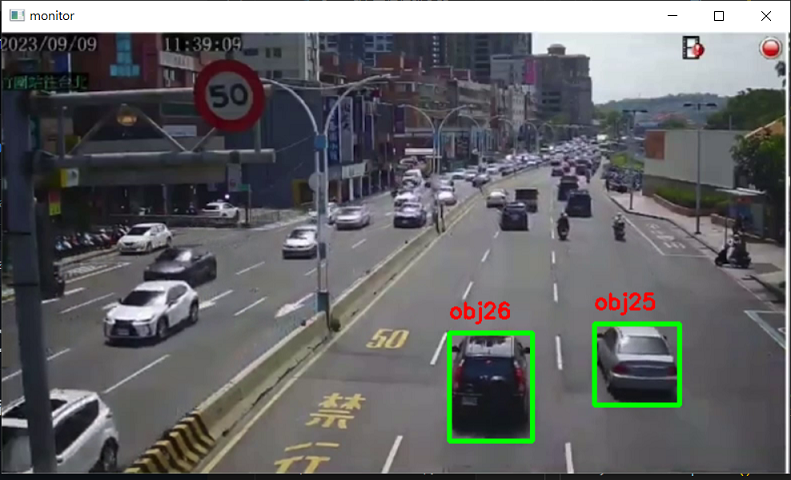
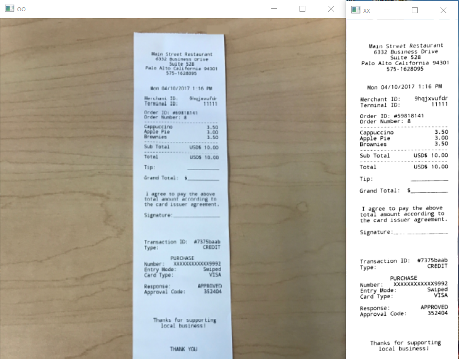
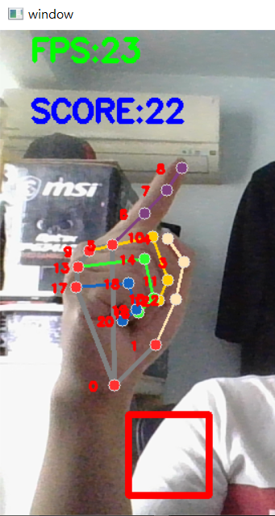

# OpenCV
存放各個項目實作以及其他opencv小練習
- 信用卡號辨識
- 車流監控
- 睡意檢測
- 文檔ocr辨識
- mediapipe手部追蹤

## 車流監控
1.使用cv2.createBackgroundSubtractorKNN()區隔出動態物件
``` python
object_detector = cv2.createBackgroundSubtractorKNN()
```

2.透過影片每幀圖片中的物件移動距離來判別是否為同一個物件
``` python
# 確認此物體是否已存在 或是新偵測到
      same_object_detected = False
      for id, pt in self.center_points.items():
        # 歐式距離 hypot計算三角形斜邊距離
        dist = math.hypot(cx-pt[0], cy-pt[1])
        if dist<25:
          self.center_points[id] = (cx,cy)
          print(self.center_points)
          objects_bbs_ids.append([x,y,w,h,id])
          same_object_detected = True
          break
      if same_object_detected is False:
        self.center_points[self.id_count] =(cx, cy)
        objects_bbs_ids.append([x,y,w,h,self.id_count])
        self.id_count += 1
```
### 功能展示


## 文檔ocr辨識
- step1.文檔圖片偏斜校正
- step2.OCR掃描辨識
### 功能展示


## Mediapipe手部追蹤
- 成功偵測到手
- 找出手部食指點位座標
- 製作戳框小遊戲
### 功能展示




